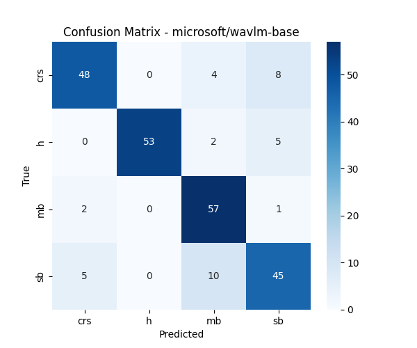

# Bowel-sounds-classification

This repository provides a **pipeline for bowel sound classification** using state-of-the-art deep learning models.  
The pipeline is implemented with **PyTorch**, **Hugging Face Transformers**, **Torchaudio**, and **Scikit-Learn**.  
It supports **single-model fine-tuning** as well as **ensemble learning** across multiple pre-trained speech models.

---

## Project Overview

- **Input**
  - Raw audio files (`.wav`) containing bowel sound recordings.
  - Ground-truth `.txt` files with start time, end time, and label of each sub-audio segment.

- **Pipeline Features**
  - Fine-tuning of multiple Hugging Face models (e.g., HuBERT, Wav2Vec2, WavLM).
  - Support for **imbalanced datasets** (downsampling/upsampling).
  - Evaluation with **precision, recall, F1-score** (per class).
  - Saving of **confusion matrices** for deeper analysis.
  - Ensemble prediction (average of logits across models).

---

## Installation

Clone the repository and install dependencies:

```bash
git clone https://github.com/yourusername/bowel-sound-classification.git
cd bowel-sound-classification
pip install -e .
````

The training and validation data should be placed in the corresponding folders under `data/raw`.  
Note that each audio file must have a matching `.txt` file with the same name.


## Usage

### 1. Data Preparation

To prepare data for bowel sound classification:

```bash
python src/data/prepare_data.py
```

### This will:

- Load the dataset defined in `config.yaml`.
- Apply smoothness duration on subaudios.
- Balance train and validation datasets.
- Perform train/validation/test split.  

### 2. Training & Evaluation

To fine-tune a model (or an ensemble of models):

```bash
python src/train/train_evaluate.py
```
### This will:
 
- Fine-tune each model (or ensemble).  
- Save the best model checkpoint and logs in `./results`.

## 2. Model deployment

- The model is deployed using **FastAPI**.  
- After training, the best checkpoint should be saved in `deployment/models`.

To run deployment :

```bash
python deployment/run.py
```
### This will:

- Load the trained model(s).
- Perform sliding-window multi-event prediction to detect audio class start and end timestamp.  
- Merge consecutive predictions of the same class.


## Model Performance Overview  

The following section provides an overview of the model's performance.  
(Example shown using **`microsoft/wavlm-base`** after 7 epochs of training.)

### Confusion Matrix (Validation)  


### Metrics  

#### Per-class metrics  

| Class | F1 Score | Precision |
|-------|----------|-----------|
| crs   | 0.8214   | 0.8846    |
| h     | 0.9298   | 0.9815    |
| mb    | 0.8296   | 0.7467    |
| sb    | 0.7563   | 0.7627    |

#### Overall metrics  

| Metric      | Value |
|-------------|-------|
| Accuracy    | 0.85  |
| Macro F1    | 0.83  |
| Weighted F1 | 0.86  |


